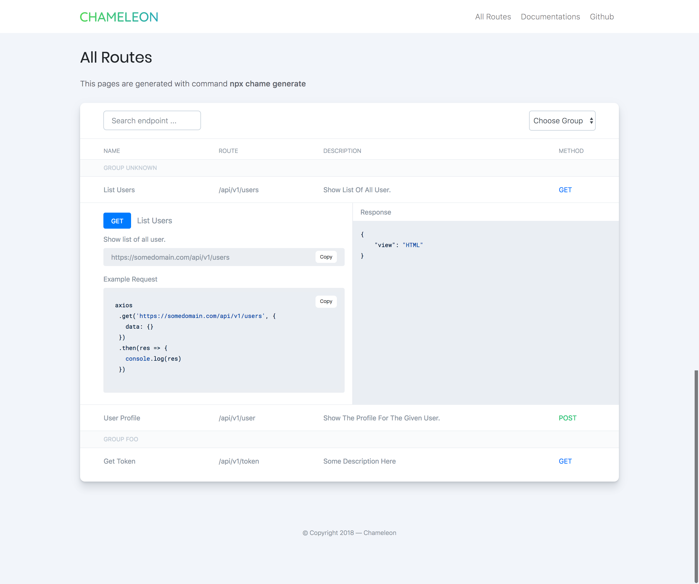

# 🍃 Chameleon — WIP

The next generation REST APIs Documentation, simple configuration with cross language and framework. Just write simple config and write **chameleon** comments on any your route method.

### Single Command

Generate APIs documentation only using this command :

```bash
$ npx chame generate
```

> Note : The command above, just for documentation. This project currently on development, so don't use it until release.

### Preview v1.0

On development version [Demo](https://muhibbudins.github.io/chameleon/template).



### Usage

First of all, create **chameleon.yml** on your REST APIs project. With content like code below :

```yaml
# chameleon.yml

name: Chameleon    # Project Name
path: /api/v1      # Route Group from APIs
source: src        # Source directory to be generate by chameleon
destination: docs  # Destination folder (default: docs)
```

> You can use separe folder for destination, eg. **public/docs**

Next, create block comment on your documented method. Like example below :

```php
<?php

namespace App\Http\Controllers;

use App\User;
use App\Http\Controllers\Controller;

class UserController extends Controller
{
  /**
   * @chameleon
   * 
   * @name        : Show User
   * @description : Show the profile for the given user.
   * @route       : /user
   * @method      : GET
   * @parameter   : {
   *  id : Integer
   * }
   * @response    : {
   *  view     : HTML
   * }
   */
  public function show($id)
  {
      return view('user.profile', ['user' => User::findOrFail($id)]);
  }
}
```

Last, run this command on your root project :

```bash
$ npx chame generate
```

> Note : This project under development, so don't use for production it after release. Except, you want to try this development version.

### License

This project under MIT License