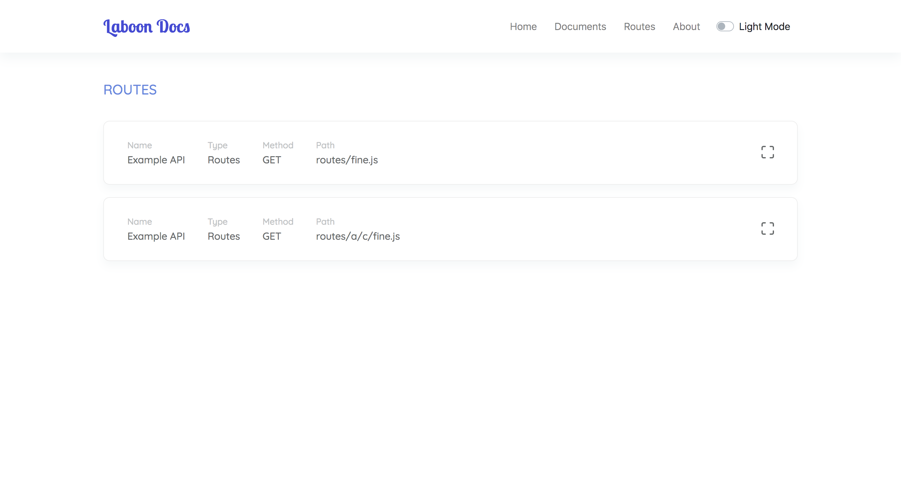
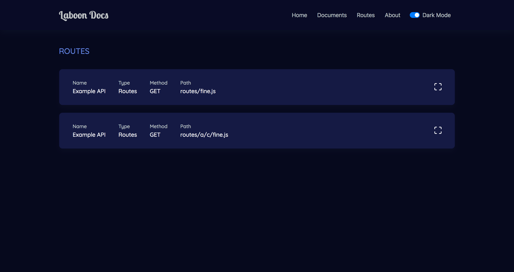
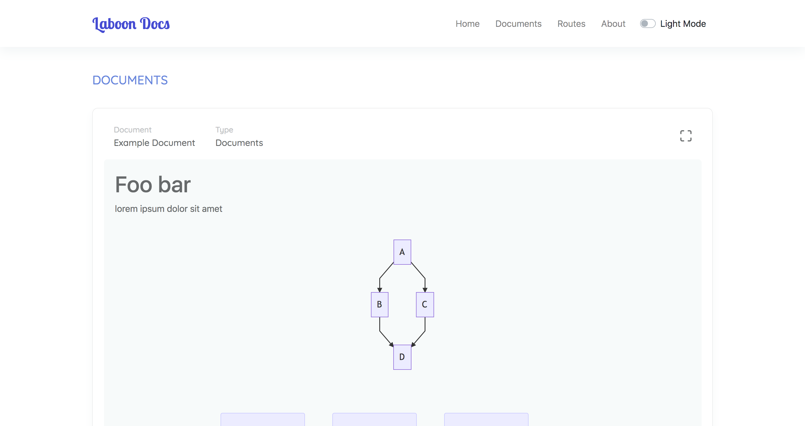

# Meet 🐋 Laboon — WIP

The next generation REST APIs Documentation, with simple configuration, cross language and framework. Just write one config and **laboon** comments on your REST APIs project.

### Command

Install **laboon** with :

```
$ npm install -g @laboon/cli
# or
$ yarn global add @laboon/cli
```

Generate APIs documentation only using this command :

```bash
$ laboon --help

🐋 The next generation REST APIs Documentation

Usage
  $ laboon <input>

Options
  --format, -f  Include a format
  --exclude, -e  Include a exclude
  --source, -s  Include a source
  --destination, -d  Include a destination
  --host, -h  Include a host
  --port, -p  Include a port

Examples
  $ laboon -f vue -f md -e node_modules -s src -d docs -h 0.0.0.0 -p 3456
```

> Note : The command above, just for documentation. This project currently on development, so don't use it until release.

### Preview

| Light Mode | Dark Mode |
|:---:|:---:|
|||
| Graph Preview |
|:---:|
||

### Usage

First of all, create **laboon.yml** on your REST APIs project. With content like code below :

```yaml
# laboon.yml

name: Laboon                      # Project Name
endpoint: https://somedomain.com  # Domain name / IP for API endpoint 
path: /api/v1                     # Route Group from APIs
source: src                       # Source directory to be generate by laboon
destination: docs                 # Destination folder (default: docs)
```

> You can use separate folder for destination, eg. **public/docs**

Next, create block comment on your documented method. Like example below :

```php
<?php

namespace App\Http\Controllers;

use App\User;
use App\Http\Controllers\Controller;

class UserController extends Controller
{
  /**
   * @laboon
   * 
   * @name        : Show User
   * @description : Show the profile for the given user.
   * @route       : /user
   * @method      : GET
   * @parameter   : {
   *  id : Integer
   * }
   * @response    : {
   *  view     : HTML
   * }
   */
  public function show($id)
  {
      return view('user.profile', ['user' => User::findOrFail($id)]);
  }
}
```

Last, run this command on your root project :

```bash
$ laboon
```

> Note : This project under development, so don't use for production it after release. Except, you want to try this development version.

### License

This project under MIT License